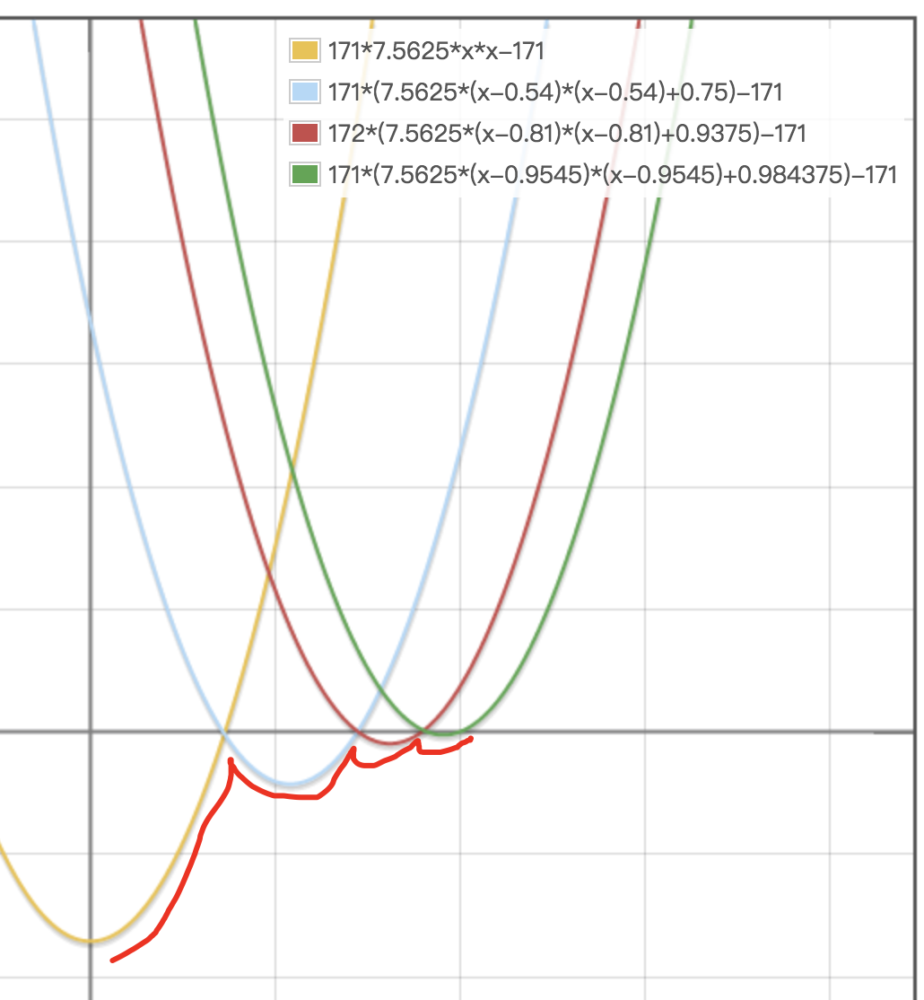

# 引导动画

项目地址：[Github](https://github.com/daimajia/AndroidViewAnimations)

动画效果：


这个库使用起来还是非常方便的：例如在点击的时候，就可以设置某个视图的动画效果

```
 findViewById(R.id.submit).setOnClickListener(new View.OnClickListener() {
            @Override
            public void onClick(View v) {

                YoYo.with(Techniques.Tada)
                        .duration(700)
                        .playOn(findViewById(R.id.edit_area));

                t.setText("Wrong password!");
            }
        });
```

YoYo.with(Techniques.Tada)返回一个new AnimationComposer(techniques)的对象，主要用于设置动画的参数。

playOn(target);的时候，将参数设置到animator中并通过animator.setTarget(target);设置作用对象，然后调用play，实际上就是设置好动画参数，然后执行animator.animate()开始动画

```

    private BaseViewAnimator play() {
        animator.setTarget(target);

        if (pivotX == YoYo.CENTER_PIVOT) {
            ViewCompat.setPivotX(target, target.getMeasuredWidth() / 2.0f);
        } else {
            target.setPivotX(pivotX);
        }
        if (pivotY == YoYo.CENTER_PIVOT) {
            ViewCompat.setPivotY(target, target.getMeasuredHeight() / 2.0f);
        } else {
            target.setPivotY(pivotY);
        }

        animator.setDuration(duration)
                .setRepeatTimes(repeatTimes)
                .setRepeatMode(repeatMode)
                .setInterpolator(interpolator)
                .setStartDelay(delay);

        if (callbacks.size() > 0) {
            for (Animator.AnimatorListener callback : callbacks) {
                animator.addAnimatorListener(callback);
            }
        }
        animator.animate();
        return animator;
    }
```

来挑几个基本的动画实现或者几个有意思的实现来看看吧。

所以textview的demo动画有几个基本的设置默认一些参数，执行时间为1200，无限循环，中心点，

```
                        .duration(1200)
                        .repeat(YoYo.INFINITE)
                        .pivot(YoYo.CENTER_PIVOT, YoYo.CENTER_PIVOT)
                        .interpolate(new AccelerateDecelerateInterpolator())
```


## 弹性掉落

DropOutnAnimator

```
public class DropOutAnimator extends BaseViewAnimator {
    @Override
    protected void prepare(View target) {
        int distance = target.getTop() + target.getHeight();
        getAnimatorAgent().playTogether(
                ObjectAnimator.ofFloat(target, "alpha", 0, 1),
                Glider.glide(Skill.BounceEaseOut, getDuration(), ObjectAnimator.ofFloat(target, "translationY", -distance, 0))
        );
    }
}
```

prepare()方法在设置setTarget的时候被调用，这里主要用于AnimatorSet的设置

```
 public BaseViewAnimator setTarget(View target) {
        reset(target);
        prepare(target);
        return this;
    }
```

DropOutAnimator在prepare的时候设置了两个动画，一个是透明度从从0到1，这个比较好理解，在透明度变化的同时，有个y轴位置上的偏移动画，这个y轴的位置偏移不是简单的线性偏移，而是带有球回弹效果的偏移，这种偏移怎么实现的呢？

先看ObjectAnimator.ofFloat(target, "translationY", -distance, 0)表示将translationY属性从-171到0的一个变化，-171的时候超出屏幕之外，不可见，然后慢慢向下移，移动到view的top为0的位置，即view在屏幕的top位置。

再看Glider.glide(Skill.BounceEaseOut, getDuration(), ValueAnimator XXXX)，表示将 的这种TypeEvaluator通过animator.setEvaluator(TypeEvaluator t);设置到ValueAnimator XXXXanimator中，这个animator就是前面说的translationY偏移动画中。这种组合将产生奇妙的效果，那Skill.BounceEaseOut具体对translationY的偏移有什么影响呢？

TypeEvaluator的核心在于evaluate方法，子类通过override该方法，通过参数fraction因素和startValue\endValue来计算中间值

```
public interface TypeEvaluator<T> {
    T evaluate(float fraction, T startValue, T endValue);
}
```

DropOutAnimator的集成关系是：DropOutAnimator->BaseEasingMet->TypeEvaluator，其中BaseEasingMet对evaluate进行了

```
 @Override
    public final Float evaluate(float fraction, Number startValue, Number endValue){
        float t = mDuration * fraction;
        float b = startValue.floatValue();
        float c = endValue.floatValue() - startValue.floatValue();
        float d = mDuration;
        float result = calculate(t,b,c,d);
        for(EasingListener l : mListeners){
            l.on(t,result,b,c,d);
        }
        return result;
    }

    public abstract Float calculate(float t, float b, float c, float d);
```

其中，算法分析如下：

```
 public  Float calculate(float t, float b, float c, float d){
                Log.i("DropOutAnimator","time="+t+"start b="+b+"length c="+c+"duration="+d);
                if ((t/=d) < (1/2.75f)) {//f=0.36
                    return c*(7.5625f*t*t) + b;
                } else if (t < (2/2.75f)) {//f=0.72727272
                    return c*(7.5625f*(t-=(1.5f/2.75f))*t + .75f) + b;
                } else if (t < (2.5/2.75)) {
                    return c*(7.5625f*(t-=(2.25f/2.75f))*t + .9375f) + b;
                } else {
                    return c*(7.5625f*(t-=(2.625f/2.75f))*t + .984375f) + b;
                }
            }
```

第一个阶段f从0-0.36的时候，将参数带入`171*7.5625*x*x-171`得到-171-0的值，完成了y坐标从-171到0的drop过程。

第二个阶段0.36-0.7272，带入参数为`171*(7.5625*(x-0.54)*(x-0.54)+0.75)-171`完成从0到-42.75再到0的过程

以此类推，算法的图形如下



```
01-11 00:29:10.884 12553-12553/com.daimajia.androidanimations I/DropOutAnimator: result=-13.279831
01-11 00:29:10.900 12553-12553/com.daimajia.androidanimations I/DropOutAnimator: fraction=0.37059042startValue=-171.0fraction=0.0
01-11 00:29:10.902 12553-12553/com.daimajia.androidanimations I/DropOutAnimator: time=444.7085start b=-171.0length c=171.0duration=1200.0
01-11 00:29:10.902 12553-12553/com.daimajia.androidanimations I/DropOutAnimator: result=-3.2075958
```

以上，就是弹性掉落的动画分析啦


